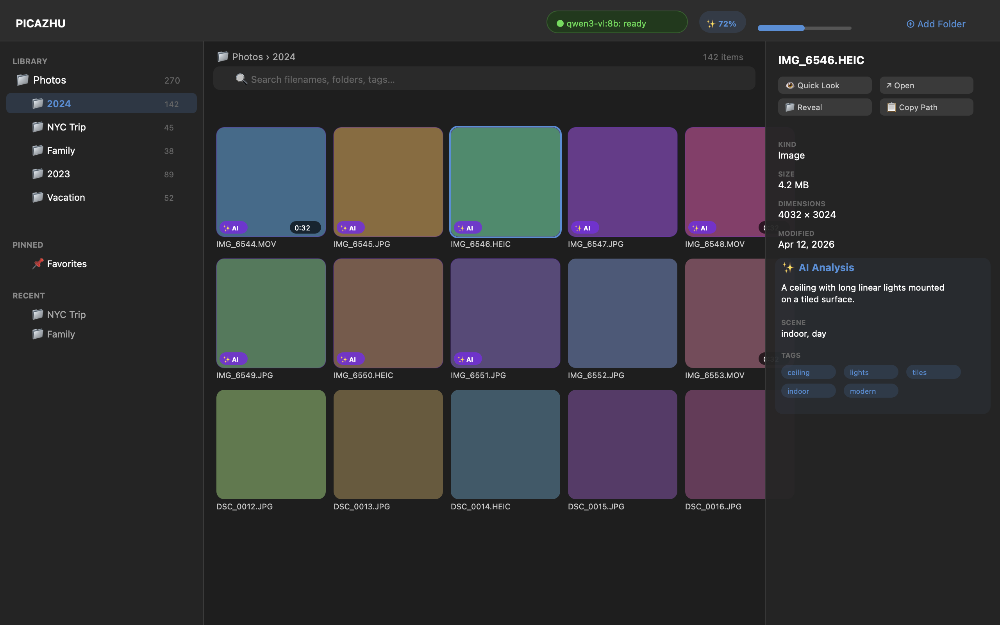
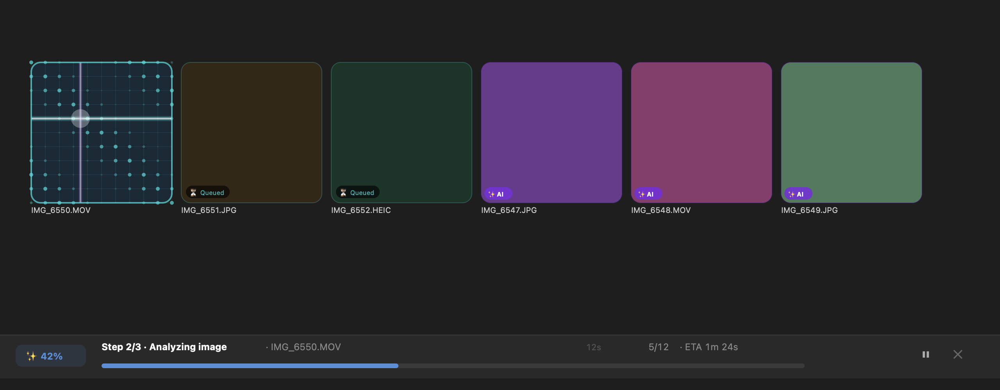

<p align="center">
  
</p>

<h1 align="center">PICAZHU</h1>

<p align="center">
  <strong>The most beautiful and intelligent media browser for macOS.</strong><br>
  Local-first. AI-powered. Privacy-respecting.
</p>

<p align="center">
  
  
  
  
  
</p>

---

## What is PICAZHU?

PICAZHU is a native macOS desktop app that lets you **browse, organize, and search your photos and videos** using real folders on your filesystem. No cloud. No lock-in. No moving your files.

Point PICAZHU at your folders. It indexes them instantly, generates thumbnails, extracts metadata, and optionally enriches everything with AI-powered captioning, tagging, and OCR — so you can search for *what's in your photos*, not just filenames.

### Search like you think

> *"dog on the beach"* &nbsp; *"dark rainy day"* &nbsp; *"red bicycle"* &nbsp; *"WALMART sign"*

PICAZHU understands the content of your images. Search by objects, scenes, mood, or even text visible in photos — all powered by local or cloud AI models through Ollama.

## Key Features

### Media Browser
- **Folder-first design** — your filesystem is the source of truth. PICAZHU never moves, copies, or modifies your files.
- **Instant indexing** — streaming pipeline indexes thousands of photos in seconds. Items appear in the grid as they're discovered.
- **Beautiful grid** — adaptive thumbnail grid with adjustable cell size, smooth scrolling, and premium visual design.
- **Three-column layout** — sidebar (folder tree + pinned + recent), content grid with breadcrumbs, and inspector panel.
- **Quick Look** — press Space for native macOS Quick Look preview. Open, Reveal in Finder, Copy Path with keyboard shortcuts.
- **Smart search** — full-text search over filenames, folders, AI captions, tags, and OCR text, scoped to the current folder.
- **Live folder watching** — FSEvents-based monitoring picks up adds, deletes, renames, and moves without rescanning.
- **Security-scoped bookmarks** — sandboxed app with persistent folder access that survives relaunches.

### AI Enrichment
- **Per-folder opt-in** — right-click a folder to analyze it with AI. Nothing runs automatically. You control what gets processed.
- **Dual provider support** — Local Ollama (fully private, your hardware) or Ollama Cloud (faster, larger models).
- **Structured captioning** — each image gets a natural-language caption, 5-15 tags, detected objects, scene description, and confidence score.
- **Apple Vision OCR** — text in photos (signs, labels, screens) is extracted using Apple's on-device Vision framework. Fast, accurate, always local.
- **Hybrid search** — combines FTS5 full-text search with cosine-similarity semantic ranking over caption embeddings.
- **Visual feedback** — neural-scan radar overlay on thumbnails during analysis, "Queued" badges on waiting items, "AI" badges on completed items.
- **Live progress** — bottom-of-window progress bar with sub-stage tracking (OCR → VLM → Embed), elapsed timer, ETA, pause/cancel.
- **In-app settings** — switch between Local and Cloud, pick models from a dropdown, enter API keys, test connection — all without touching config files.

### Performance & Privacy
- **Thumbnails only** — AI models only see 512px thumbnails from the cache. Originals never leave the app, even locally.
- **Auto model management** — local models warm up on launch and unload from RAM on quit.
- **WAL-mode SQLite** — fast concurrent reads, single coordinated writer, crash-safe.
- **Streaming indexing** — 500-file batches committed per-transaction so items appear progressively.
- **Self-healing catalog** — folder hierarchy auto-corrects on rescan. Stale bookmarks surface in diagnostics.

## Screenshots

### Main Window
Three-column layout: folder tree sidebar, adaptive thumbnail grid with AI badges, and inspector panel with captions, tags, and metadata.



### AI Analysis In Progress
Neural-scan radar effect on the active thumbnail, "Queued" badges on waiting items, "AI" badges on completed items, and the sub-stage progress bar at the bottom.



## Requirements

- **macOS 15.0 Sequoia** or later
- **Apple Silicon** (M1/M2/M3/M4)
- **Ollama** (optional, for AI features) — [Install Ollama](https://ollama.com/download)

## Quick Start

### Build from source

```bash
git clone https://github.com/ablakateam/picazhu.git
cd picazhu

# Build
xcodebuild -project PICAZHU.xcodeproj -scheme PICAZHU \
  -configuration Release -derivedDataPath build/DerivedData build

# Run
cp -R build/DerivedData/Build/Products/Release/PICAZHU.app build/PICAZHU.app
open build/PICAZHU.app
```

### Set up AI (optional)

```bash
# Install Ollama
brew install ollama

# Pull the vision model (~6 GB)
ollama pull qwen3-vl:8b

# Pull the embedding model (~274 MB)
ollama pull nomic-embed-text

# Verify
curl http://localhost:11434/api/tags | jq '.models[].name'
```

Then in PICAZHU: click the **gear icon** → confirm models are detected → select a folder → click **Analyze**.

### Cloud AI (alternative)

If you have an Ollama Cloud account:
1. Gear icon → switch to **Ollama Cloud**
2. Enter your API key (from [ollama.com/settings/keys](https://ollama.com/settings/keys))
3. Select `qwen3-vl:235b-instruct` as the vision model
4. Test Connection → Save & Apply

Cloud uses the 235B parameter model on Ollama's GPUs — faster and more capable, no local resources needed.

## Architecture

```
PICAZHU/
├── PICAZHU.xcodeproj
├── App/                          # SwiftUI app target
│   ├── PicazhuMacApp.swift       # @main, scenes, menus
│   ├── AppEnvironment.swift      # DI container
│   ├── LibraryViewModel.swift    # All UI state
│   ├── RootView.swift            # 3-column layout
│   ├── AISettingsSheet.swift     # Provider config UI
│   ├── SplashView.swift          # Launch screen
│   └── DebugConsole.swift        # In-app log viewer
└── PicazhuKit/                   # Local Swift package
    ├── Package.swift             # Single dep: GRDB.swift
    └── Sources/
        ├── PicazhuCore           # Domain types, IDs, errors, logging
        ├── PicazhuData           # SQLite, migrations, repositories
        ├── PicazhuMedia          # Thumbnails, metadata readers
        ├── PicazhuIndexing       # Scanner, FSEvents, bookmarks
        ├── PicazhuPreview        # Quick Look bridge
        ├── PicazhuSearch         # FTS5 + hybrid semantic engine
        ├── PicazhuAI             # Ollama client, VLM provider, enrichment coordinator
        ├── PicazhuVision         # Apple Vision OCR
        ├── PicazhuDiagnostics    # Health checks, stats
        └── PicazhuUI             # Design tokens, grid, inspector, effects
```

**10 Swift Package modules** with strict dependency graph (no cycles). Single external dependency: [GRDB.swift](https://github.com/groue/GRDB.swift) for SQLite.

### Data Model

SQLite catalog with 3 migrations, 14 tables + FTS5 virtual table. WAL mode, foreign keys enforced, one `CatalogWriter` actor coordinates all writes.

| Table | Purpose |
|---|---|
| `watched_roots` | Folder bookmarks with access state |
| `folders` | Recursive folder tree with item/child counts |
| `media_items` | Every photo/video with path, size, dimensions, AI state |
| `metadata` | EXIF, GPS, camera info, video codec |
| `media_fts` | FTS5 index over filename, folder, caption, tags, OCR |
| `ai_enrichment` | Captions, tags, objects, scene, OCR text per item |
| `ai_embeddings` | Vector file paths for semantic search |
| `ai_providers` | Saved Ollama config (host, model, API key) |

### AI Pipeline

```
Image selected for analysis
    │
    ├── Apple Vision OCR ──────────────── ocr_text
    │   (local, sub-second, 32 languages)
    │
    ├── Qwen3-VL via Ollama ───────────── caption, tags[], objects[], scene
    │   (structured JSON output)
    │
    └── nomic-embed-text ──────────────── 768-dim float vector
        (caption → embedding)
    │
    ▼
SQLite: ai_enrichment + ai_embeddings + media_fts
    │
    ▼
Search: FTS5 BM25 (60%) + cosine similarity (40%)
```

## Keyboard Shortcuts

| Action | Shortcut |
|---|---|
| Add Folder | `⌘N` |
| Analyze Current Folder | `⌘⇧I` |
| Quick Look | `Space` |
| Open in Default App | `⌘↩` |
| Reveal in Finder | `⌘⇧R` |
| Copy Path | `⌘⌥C` |
| Smaller Thumbnails | `⌘-` |
| Larger Thumbnails | `⌘=` |
| Diagnostics | `⌘⇧D` |

## Debug Console

Click the **terminal icon** in the toolbar to open the in-app debug console. It shows timestamped, color-coded logs of everything happening under the hood — config changes, Ollama health checks, job processing, VLM calls, errors.

For external logging:
```bash
log stream --predicate 'subsystem == "com.picazhu.mac"' --level info
```

## Tech Stack

| Component | Technology |
|---|---|
| Language | Swift 6.2 |
| UI Framework | SwiftUI + AppKit interop |
| Database | SQLite via [GRDB.swift](https://github.com/groue/GRDB.swift) |
| Search | FTS5 + cosine similarity |
| Thumbnails | QuickLookThumbnailing + AVAssetImageGenerator |
| Metadata | Image I/O (EXIF/GPS) + AVFoundation |
| File Watching | FSEvents (CoreServices) |
| OCR | Apple Vision (VNRecognizeTextRequest) |
| AI Vision | Ollama (Qwen3-VL) |
| AI Embeddings | Ollama (nomic-embed-text) |
| Min Target | macOS 15.0 Sequoia |
| Architecture | arm64 (Apple Silicon) |

## Roadmap

- [x] Phase 1: Full media browser with search, Quick Look, diagnostics
- [x] Phase 2: AI enrichment pipeline (Ollama + Apple Vision)
- [x] AI Settings UI with Local/Cloud switching
- [x] Neural-scan visual effects + progress bar
- [x] Splash screen + app icon
- [ ] Video multi-frame analysis (5 keyframes per video)
- [ ] Sort/filter chips (by date, type, size, AI tags)
- [ ] OpenAI provider adapter (GPT-4o Vision)
- [ ] Saved searches UI
- [ ] Developer ID signing + notarized DMG
- [ ] Auto-update via Sparkle

## License

Proprietary. All rights reserved.

## Acknowledgments

- [GRDB.swift](https://github.com/groue/GRDB.swift) — the excellent SQLite toolkit for Swift
- [Ollama](https://ollama.com) — local AI model runtime
- [Qwen3-VL](https://github.com/QwenLM/Qwen3-VL) — vision-language model by Alibaba Cloud
