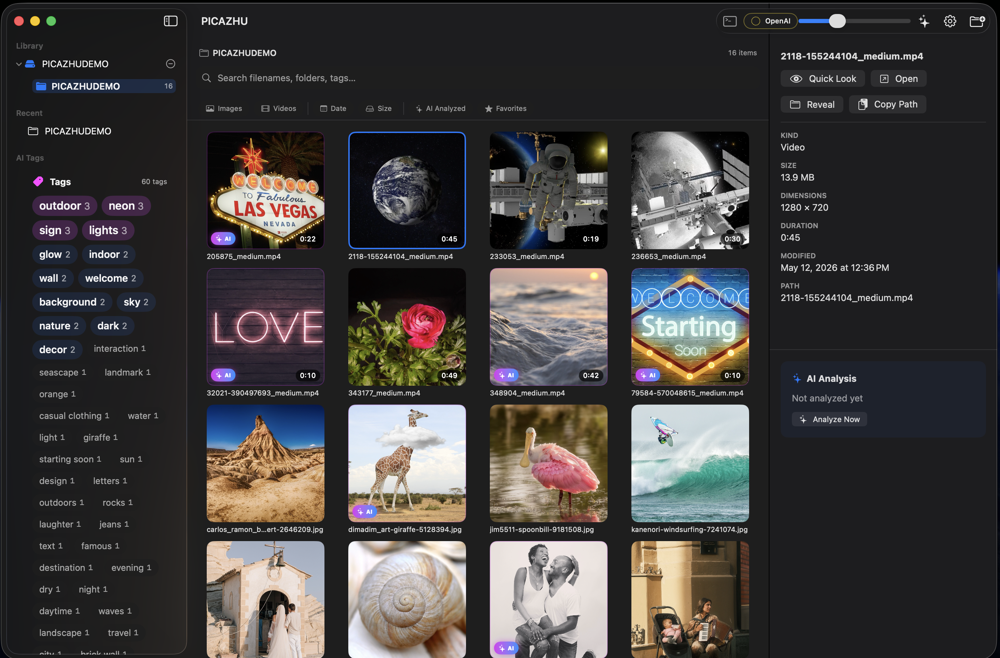
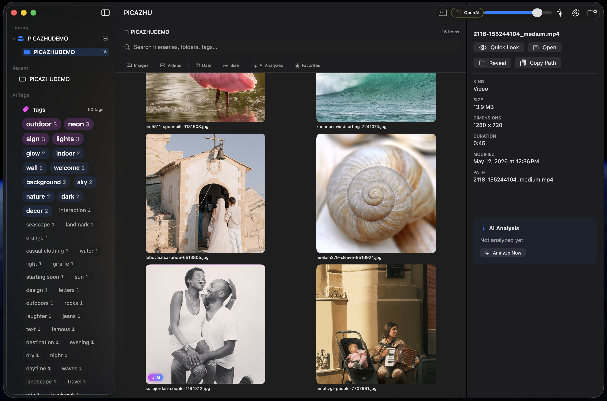
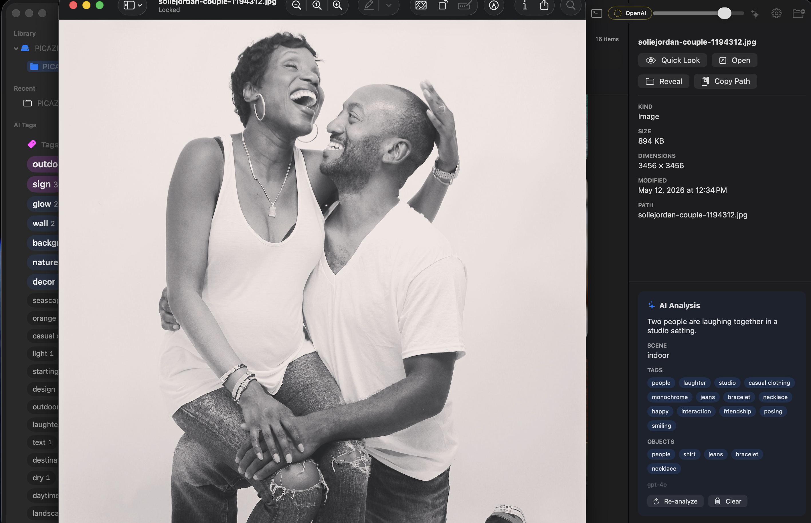
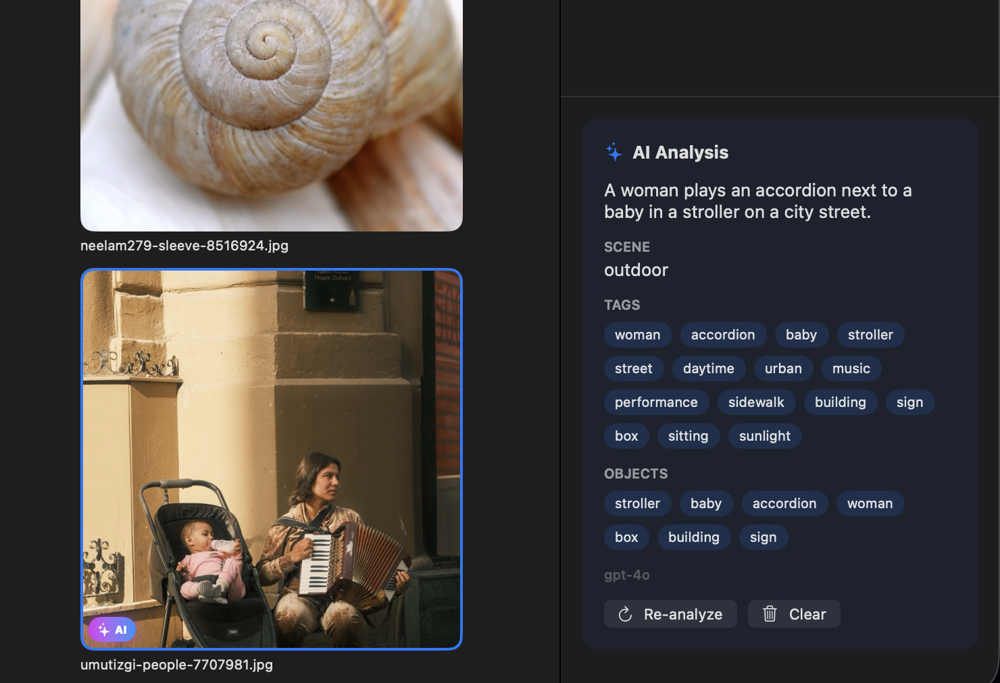
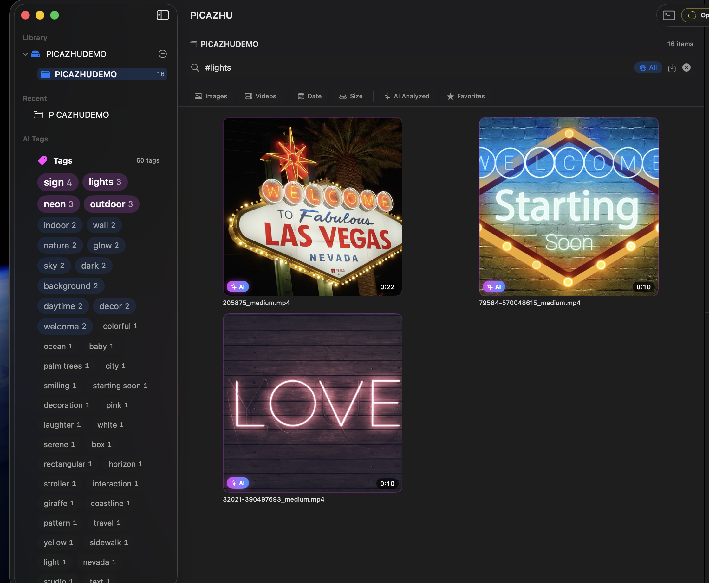

<p align="center">
  
</p>

<h1 align="center">PICAZHU</h1>

<p align="center">
  <strong>The most beautiful and intelligent media browser for macOS.</strong><br>
  Local-first. AI-powered. Privacy-respecting.
</p>

<p align="center">
  
  
  
  
  
</p>

---

## Why I Built This

I got tired of managing my photos and videos with native apps — the way they display files, the lack of real folder control, the clunky cataloging. I just wanted a fast, beautiful way to browse my media from real folders, find what I need instantly, and not fight the tool.

So I built PICAZHU for myself — and for every media professional who needs a quick, no-nonsense way to organize and review files after a shoot, a video session, or a production day. No importing, no libraries, no lock-in. Just point it at your folders and go.

I'm also a fan of air-gapped AI models — your data should stay on your machine. That's why PICAZHU uses Ollama with vision models running locally on your Mac. Your photos never leave your computer. But if you want faster processing, you can also switch to Ollama's cloud API and use their hosted models — your choice, one toggle in settings.

Enjoy it. And if you need any improvements — [let me know](https://github.com/ablakateam/picazhu/issues).

---

## What is PICAZHU?

PICAZHU is a native macOS desktop app that lets you **browse, organize, and search your photos and videos** using real folders on your filesystem. No cloud. No lock-in. No moving your files.

Point PICAZHU at your folders. It indexes them instantly, generates thumbnails, extracts metadata, and optionally enriches everything with AI-powered captioning, tagging, and OCR — so you can search for *what's in your photos*, not just filenames.

### Search like you think

> *"dog on the beach"* &nbsp; *"dark rainy day"* &nbsp; *"red bicycle"* &nbsp; *"WALMART sign"*

PICAZHU understands the content of your images. Search by objects, scenes, mood, or even text visible in photos — all powered by local or cloud AI models through Ollama.

## Key Features

### Media Browser
- **Folder-first design** — your filesystem is the source of truth. PICAZHU never moves, copies, or modifies your files.
- **Instant indexing** — streaming pipeline indexes thousands of photos in seconds. Items appear in the grid as they're discovered.
- **Beautiful grid** — adaptive thumbnail grid with adjustable cell size, smooth scrolling, and premium visual design.
- **Three-column layout** — sidebar (folder tree + pinned + recent), content grid with breadcrumbs, and inspector panel.
- **Quick Look** — press Space for native macOS Quick Look preview. Open, Reveal in Finder, Copy Path with keyboard shortcuts.
- **Smart search** — full-text search over filenames, folders, AI captions, tags, and OCR text. Toggle between current folder and global (all folders) scope.
- **Filter chips** — filter by media type (Images/Videos), date range (Today/Week/Month/Year), file size, AI-analyzed status, or favorites. All filters combine with search.
- **Favorites** — star any photo or video. Yellow star badge on thumbnails. Filter to show only favorites.
- **Saved searches** — save any search + filter combo to the sidebar for one-click recall. Right-click to delete.
- **Batch operations** — right-click the grid to analyze selected items, clear AI data, copy paths, open, or reveal. Select All with ⌘A.
- **Keyboard navigation** — arrow keys to move selection in the grid, Enter to open, auto-scroll to keep selection visible.
- **Drag-and-drop** — drop folders from Finder onto the app window to add them as watched roots.
- **Live folder watching** — FSEvents-based monitoring picks up adds, deletes, renames, and moves without rescanning.
- **Security-scoped bookmarks** — sandboxed app with persistent folder access that survives relaunches.
- **EXIF/GPS map** — select a photo with GPS data to see a map with pin, coordinates, camera make/model, lens, exposure settings, and "Open in Maps" button.
- **Duplicate detection** — `File → Find Duplicates` (⌘⌥D) scans the current folder using perceptual hashing (pHash) to find visually similar images. Results shown with thumbnails and similarity percentage.
- **iPhone USB import** — plug in an iPhone, it appears in the sidebar. Click to browse photos on the device with thumbnails, select files, choose a destination folder, and import with progress tracking.

### AI Enrichment
- **Per-folder opt-in** — right-click a folder to analyze it with AI. Nothing runs automatically. You control what gets processed.
- **Three AI providers** — Local Ollama (fully private), Ollama Cloud (fast, large models), or OpenAI GPT-4o Vision. Switch with one toggle in settings.
- **Video keyframe analysis** — extracts 5 frames per video (10/30/50/70/90%), runs VLM + OCR on all frames **in parallel**, merges captions/tags/objects into one searchable result.
- **Concurrent processing** — analyzes 2 items in parallel, video frames run all 5 API calls simultaneously for 3-4x speedup on cloud.
- **Structured captioning** — each image gets a natural-language caption, 5-15 tags, detected objects, scene description, and confidence score.
- **Apple Vision OCR** — text in photos (signs, labels, screens) is extracted using Apple's on-device Vision framework. Supports 10 languages: English, Russian, French, German, Spanish, Italian, Portuguese, Chinese, Japanese, Korean.
- **Hybrid search** — combines FTS5 full-text search with cosine-similarity semantic ranking over caption embeddings.
- **Visual feedback** — neural-scan radar overlay on thumbnails during analysis, "Queued" badges on waiting items, "AI" badges on completed items.
- **Live progress** — bottom-of-window progress bar with sub-stage tracking (OCR → VLM → Embed), elapsed timer, ETA, pause/cancel.
- **In-app settings** — switch between Local and Cloud, pick models from a dropdown, enter API keys, test connection — all without touching config files.

### Performance & Privacy
- **Thumbnails only** — AI models only see 512px thumbnails from the cache. Originals never leave the app, even locally.
- **Auto model management** — local models warm up on launch and unload from RAM on quit.
- **WAL-mode SQLite** — fast concurrent reads, single coordinated writer, crash-safe.
- **Streaming indexing** — 500-file batches committed per-transaction so items appear progressively.
- **Self-healing catalog** — folder hierarchy auto-corrects on rescan. Stale bookmarks surface in diagnostics.

## Screenshots

### Media Library with AI Tags
Full library view with tag cloud sidebar, filter chips, AI badges on analyzed thumbnails, and metadata inspector.



### Browsing & Inspector
Scrolling through media with the inspector panel showing file details and AI analysis status.



### AI Analysis Results
Quick Look preview with AI-generated caption, scene, tags, and detected objects in the inspector panel.



### AI Tags & Objects Detail
Close-up of the AI analysis section showing caption, tags as pills, detected objects, and the model used.



### Tag Cloud Search
Clicking a tag in the sidebar instantly filters to matching media across the entire library.



## Requirements

- **macOS 26.0** or later
- **Apple Silicon** (M1/M2/M3/M4)
- **Ollama** (optional, for AI features) — [Install Ollama](https://ollama.com/download)

## Quick Start

### Build from source

```bash
git clone https://github.com/ablakateam/picazhu.git
cd picazhu

# Build
xcodebuild -project PICAZHU.xcodeproj -scheme PICAZHU \
  -configuration Release -derivedDataPath build/DerivedData build

# Run
cp -R build/DerivedData/Build/Products/Release/PICAZHU.app build/PICAZHU.app
open build/PICAZHU.app
```

### Set up AI (optional)

```bash
# Install Ollama
brew install ollama

# Pull the vision model (~6 GB)
ollama pull qwen3-vl:8b

# Pull the embedding model (~274 MB)
ollama pull nomic-embed-text

# Verify
curl http://localhost:11434/api/tags | jq '.models[].name'
```

Then in PICAZHU: click the **gear icon** → confirm models are detected → select a folder → click **Analyze**.

### Cloud AI (alternative)

If you have an Ollama Cloud account:
1. Gear icon → switch to **Ollama Cloud**
2. Enter your API key (from [ollama.com/settings/keys](https://ollama.com/settings/keys))
3. Select `qwen3-vl:235b-instruct` as the vision model
4. Test Connection → Save & Apply

Cloud uses the 235B parameter model on Ollama's GPUs — faster and more capable, no local resources needed.

### OpenAI (alternative)

If you prefer OpenAI:
1. Gear icon → switch to **OpenAI**
2. Enter your API key (from [platform.openai.com/api-keys](https://platform.openai.com/api-keys))
3. Defaults to `gpt-4o` for vision, `text-embedding-3-small` for embeddings
4. Test Connection → Save & Apply

## Architecture

```
PICAZHU/
├── PICAZHU.xcodeproj
├── App/                          # SwiftUI app target
│   ├── PicazhuMacApp.swift       # @main, scenes, menus
│   ├── AppEnvironment.swift      # DI container (Ollama + OpenAI)
│   ├── LibraryViewModel.swift    # All UI state
│   ├── RootView.swift            # 3-column layout
│   ├── AISettingsSheet.swift     # Provider config UI (3 modes)
│   ├── AIAdapters.swift          # Thumbnail/OCR/Embedding bridges
│   ├── OllamaStatus.swift        # Health status pill
│   ├── SplashView.swift          # Launch screen
│   ├── AboutView.swift           # About modal
│   ├── HelpView.swift            # Help guide
│   └── DebugConsole.swift        # In-app log viewer
└── PicazhuKit/                   # Local Swift package
    ├── Package.swift             # Single dep: GRDB.swift
    └── Sources/
        ├── PicazhuCore           # Domain types, IDs, errors, logging
        ├── PicazhuData           # SQLite, migrations, repositories
        ├── PicazhuMedia          # Thumbnails, metadata readers
        ├── PicazhuIndexing       # Scanner, FSEvents, bookmarks
        ├── PicazhuPreview        # Quick Look bridge
        ├── PicazhuSearch         # FTS5 + hybrid semantic engine
        ├── PicazhuAI             # Ollama + OpenAI clients, providers, enrichment coordinator
        ├── PicazhuVision         # Apple Vision OCR
        ├── PicazhuDiagnostics    # Health checks, stats
        └── PicazhuUI             # Design tokens, grid, inspector, effects, tag cloud
```

**10 Swift Package modules** with strict dependency graph (no cycles). Single external dependency: [GRDB.swift](https://github.com/groue/GRDB.swift) for SQLite.

### Data Model

SQLite catalog with 3 migrations, 14 tables + FTS5 virtual table. WAL mode, foreign keys enforced, one `CatalogWriter` actor coordinates all writes.

| Table | Purpose |
|---|---|
| `watched_roots` | Folder bookmarks with access state |
| `folders` | Recursive folder tree with item/child counts |
| `media_items` | Every photo/video with path, size, dimensions, AI state |
| `metadata` | EXIF, GPS, camera info, video codec |
| `media_fts` | FTS5 index over filename, folder, caption, tags, OCR |
| `ai_enrichment` | Captions, tags, objects, scene, OCR text per item |
| `ai_embeddings` | Vector file paths for semantic search |
| `ai_providers` | Saved provider config (Ollama or OpenAI) |

### AI Pipeline

```
Image selected for analysis
    │
    ├── Apple Vision OCR ──────────────── ocr_text
    │   (local, sub-second, 10 languages)
    │
    ├── VLM (Ollama or OpenAI) ────────── caption, tags[], objects[], scene
    │   (structured JSON output)
    │
    └── Embeddings ────────────────────── float vector
        (nomic-embed-text or text-embedding-3-small)
    │
    ▼
SQLite: ai_enrichment + ai_embeddings + media_fts
    │
    ▼
Search: FTS5 BM25 (60%) + cosine similarity (40%)
```

## Keyboard Shortcuts

| Action | Shortcut |
|---|---|
| Add Folder | `⌘N` |
| Analyze Current Folder | `⌘⇧I` |
| Quick Look | `Space` |
| Open in Default App | `⌘↩` |
| Reveal in Finder | `⌘⇧R` |
| Copy Path | `⌘⌥C` |
| Smaller Thumbnails | `⌘-` |
| Larger Thumbnails | `⌘=` |
| Diagnostics | `⌘⇧D` |
| Find Duplicates | `⌘⌥D` |
| Navigate grid | `←` `→` `↑` `↓` |
| Open selected | `Enter` |

## Debug Console

Click the **terminal icon** in the toolbar to open the in-app debug console. It shows timestamped, color-coded logs of everything happening under the hood — config changes, Ollama health checks, job processing, VLM calls, errors.

For external logging:
```bash
log stream --predicate 'subsystem == "com.picazhu.mac"' --level info
```

## Tech Stack

| Component | Technology |
|---|---|
| Language | Swift 6.2 |
| UI Framework | SwiftUI + AppKit interop |
| Database | SQLite via [GRDB.swift](https://github.com/groue/GRDB.swift) |
| Search | FTS5 + cosine similarity |
| Thumbnails | QuickLookThumbnailing + AVAssetImageGenerator |
| Metadata | Image I/O (EXIF/GPS) + AVFoundation |
| File Watching | FSEvents (CoreServices) |
| OCR | Apple Vision (VNRecognizeTextRequest) |
| AI Vision | Ollama (Qwen3-VL) or OpenAI (GPT-4o) |
| AI Embeddings | Ollama (nomic-embed-text) or OpenAI (text-embedding-3-small) |
| Min Target | macOS 26.0 |
| Architecture | arm64 (Apple Silicon) |

## Roadmap

- [x] Phase 1: Full media browser with search, Quick Look, diagnostics
- [x] Phase 2: AI enrichment pipeline (Ollama + Apple Vision)
- [x] AI Settings UI with Local/Cloud switching
- [x] Neural-scan visual effects + progress bar
- [x] Splash screen + app icon
- [x] Video 5-frame keyframe analysis with merged captions
- [x] Sort/filter chips (Images/Videos, Date, Size, AI Analyzed)
- [x] Keyboard navigation (arrow keys + Enter)
- [x] Global search toggle (current folder / all folders)
- [x] Concurrent AI enrichment (2-way parallel)
- [x] Drag-and-drop folders from Finder
- [x] Developer ID signing + notarized DMG (EBOXLAB LLC)
- [x] OpenAI provider adapter (GPT-4o Vision)
- [x] Parallel video frame analysis (3-4x speedup on cloud)
- [x] Saved searches with sidebar recall
- [x] Favorites (star items, filter chip)
- [x] Batch operations (analyze, clear, copy paths)
- [x] Multi-language OCR (10 languages)
- [x] App Store ready (no shell commands, graceful provider handling)
- [x] Tag cloud view in sidebar (sized by frequency, click to search)
- [x] EXIF/GPS map view with camera info in inspector
- [x] Duplicate detection via perceptual hashing
- [x] iPhone USB import
- [x] Window close quits app properly
- [ ] Auto-update via Sparkle
- [ ] Timeline view (photos by date)

## License

Proprietary. All rights reserved.

## Acknowledgments

- [GRDB.swift](https://github.com/groue/GRDB.swift) — the excellent SQLite toolkit for Swift
- [Ollama](https://ollama.com) — local AI model runtime
- [Qwen3-VL](https://github.com/QwenLM/Qwen3-VL) — vision-language model by Alibaba Cloud
